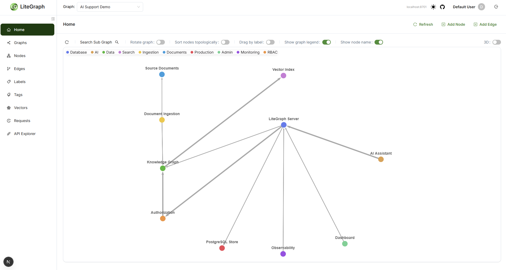
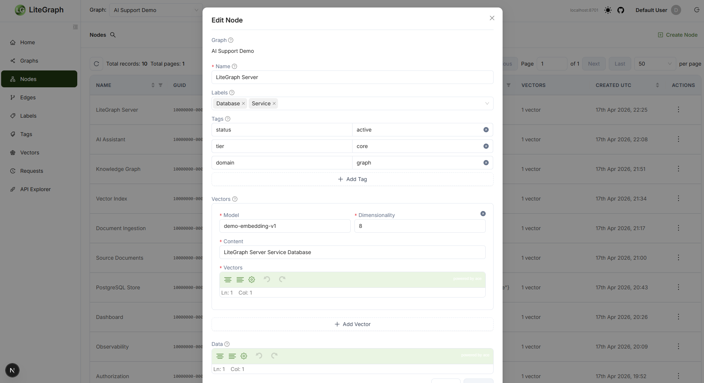
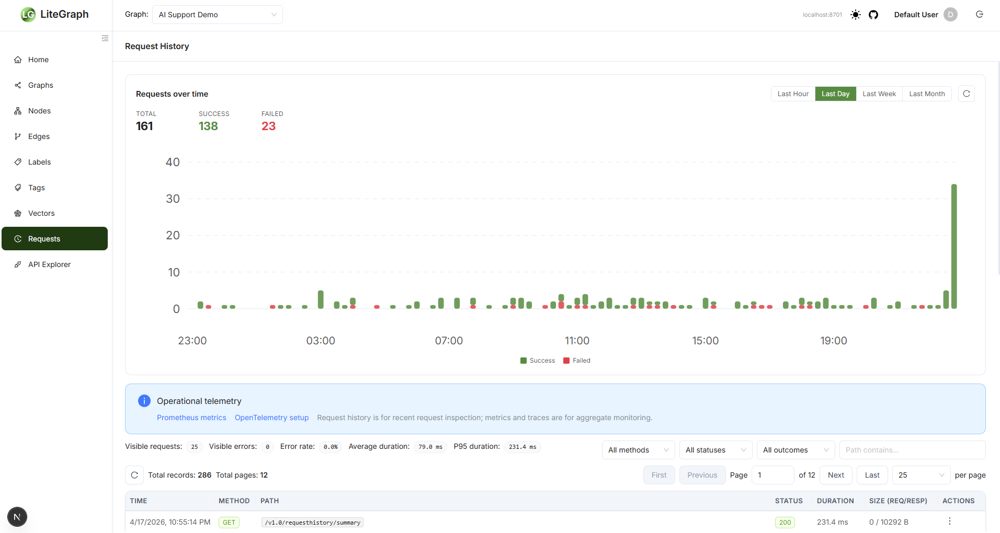
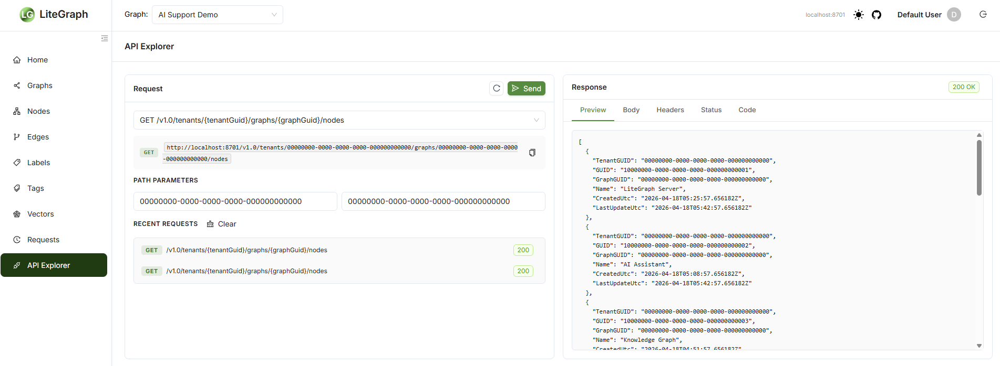
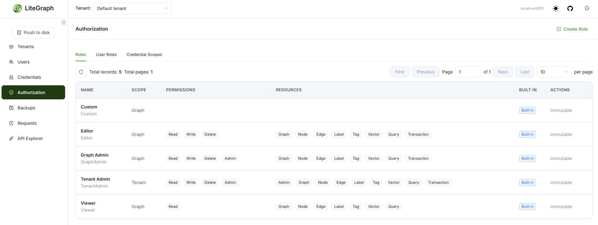
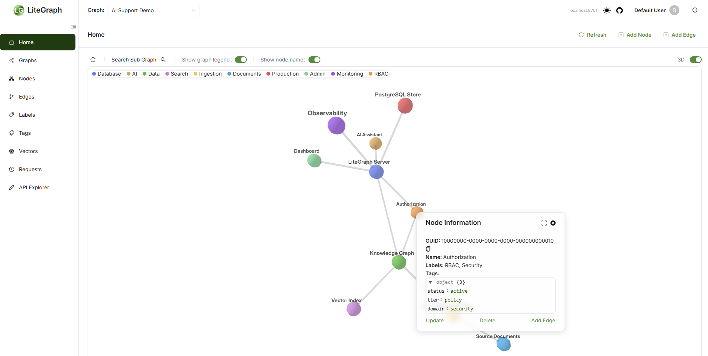

# LiteGraph

[](https://www.nuget.org/packages/LiteGraph/) [](https://www.nuget.org/packages/LiteGraph) [](https://litegraph.readme.io/)

Current release: `v9.0.0`.

LiteGraph is a property graph database for applications that need graph relationships, tags, labels, JSON data, and vector search in one persistence layer. It can be embedded in a .NET process with `LiteGraphClient`, run as a standalone REST server, used through official SDKs, managed through the dashboard, or controlled by AI agents through the Model Context Protocol (MCP).

The `v7.0.0` transaction-scaling work is now merged into `main`. Historical planning material lives under [`archive/`](archive/); the files in the repository root describe the current mainline release.

## What Is Included

- Core .NET graph library targeting `net8.0` and `net10.0`
- SQLite provider for embedded, local, and test use
- PostgreSQL provider for production deployments and parallel transaction write scaling
- Native LiteGraph graph query language for reads, traversals, vector search, and graph mutations
- Graph algorithms (centrality, PageRank, connected components, community detection) with write-back and a rustworkx/NetworkX export-compute-import path
- Graph-scoped transactions for nodes, edges, labels, tags, and vectors
- HNSW vector indexing through `HnswLite` `2.0.1`
- REST server with bearer-token authentication, request history, RBAC, and OpenAPI/Postman assets
- LLM chat over graph data with five provider types, SSE streaming, an in-process graph tool loop, and vector retrieval
- MCP server with HTTP, TCP, and WebSocket transports
- Next.js/React dashboard
- Official C#, Python, and JavaScript SDKs
- Docker Compose deployment for PostgreSQL, LiteGraph, MCP, dashboard, Prometheus, and Grafana OSS

## Screenshots

<details>
<summary>Click to expand</summary>

Chat with your graph — natural-language questions answered through graph tool calls, streamed as markdown, with per-turn statistics, a model selector, and a streaming toggle:


The home page: tenant KPIs, quick actions, and an interactive graph workspace with node inspection:



Node and vector editing — labels, tags, vectors, and JSON data in one editor:



Request telemetry — traffic over time with success/failure trends, duration percentiles, filters, and links into Prometheus and OpenTelemetry:



Provisioned Grafana dashboards — seven per-domain boards ship with the Compose stack; here, API Requests with rates, latency percentiles, errors, and authentication outcomes:


API Explorer — every REST operation, invocable with parameters and response previews:



Authorization — built-in and custom roles (including the delegable Chat Admin), scopes, permissions, and resources:



3D graph inspection:



</details>

## New In v9.0

v9.0 adds native graph algorithms across the whole product surface. Additive release — no storage migration required.

- Eleven algorithms: degree, closeness, eigenvector, and betweenness centrality; PageRank; weakly and strongly connected components; label-propagation and Louvain community detection; clustering coefficient; and k-core — computed over a whole-graph in-memory adjacency with a configurable node/edge ceiling.
- Optional write-back materializes per-node results into node data (DSL-queryable), an opt-in result cache, and a new `Algorithm` authorization resource type (compute/export require read; write-back/import require write).
- Callable from the client, the REST API, the `algorithm/*` MCP tools, the native query language (`CALL litegraph.algo.*`), the dashboard, and the C#, JavaScript, and Python SDKs.
- Graph projection export (node-link JSON, edge list, GraphML) and results import for round-tripping to external engines such as rustworkx/NetworkX for algorithms beyond native scope.
- Node embedding generation via the tenant's embedding endpoint (stored as HNSW-indexable node vectors), Prometheus/OpenTelemetry instrumentation with a provisioned Grafana algorithms dashboard, and dual-storage (SQLite + PostgreSQL) test coverage.

## New In v8.x

v8 unified accounts and observability (v8.0, breaking) and added LLM chat over graph data (v8.1).

- LLM chat built into the server. Tenants register completion and embedding endpoints for OpenAI (and compatibles), Ollama, Gemini, Anthropic, and VoyageAI; keys are stored server-side and returned redacted.
- The model queries the graph through a curated tool catalog (same names as the MCP tools), dispatched in-process under the caller's tenant and RBAC. Mutations are opt-in.
- Grounded, streaming answers. Graph-bound threads get automatic vector retrieval; responses stream over SSE, and every turn persists TTFT, tokens/sec, per-stage timings, tool transcripts, and a trace ID.
- OpenAI- and Ollama-compatible graph chat routes, so existing chat clients can talk to a graph using those wire formats.
- A full dashboard chat client: streaming markdown, model selector, slash commands, per-turn statistics, feedback, model preload, and an admin history view. Chat also reaches the MCP server and the C#, Python, and JavaScript SDKs.
- Delegable chat administration via a `Chat` authorization resource and built-in `ChatAdmin` role.
- Zero get-all APIs. Every list-returning REST route and MCP list tool responds with a paginated `EnumerationResult` envelope — never a bare array — with a guard test over the OpenAPI spec to prevent regression.
- One account model. `IsSystemAdmin` and `IsTenantAdmin` flags replace the separate administrator login; everyone else is governed by role and credential-scope RBAC. The static administrator token remains as a break-glass credential.
- One login, one dashboard, driven by a single capability map; system administrators edit `litegraph.json` from a settings page with live apply or restart.
- Everything is measured. Every REST route, MCP tool, and chat turn reports to Prometheus (with per-domain Grafana dashboards), and logs flow into Grafana through Loki and Alloy.
- Upgrading: v8.0 starts fresh (migrate from v7 via JSONL export/import); v8.1 upgrades in place, but clients that consumed list responses as bare arrays must adopt the enumeration envelope.

See [Chat](docs/CHAT.md) for the chat architecture and [REST API](docs/REST_API.md) for the routes.

## Repository Layout

| Directory | Description |
| --- | --- |
| [`src/`](src/) | Core LiteGraph library, REST server, MCP server, console, samples, and tests |
| [`dashboard/`](dashboard/) | Web dashboard UI built with Next.js and React |
| [`sdk/csharp/`](sdk/csharp/) | C# REST SDK published as `LiteGraph.Sdk` |
| [`sdk/python/`](sdk/python/) | Python REST SDK published as `litegraph-sdk` |
| [`sdk/js/`](sdk/js/) | JavaScript/Node.js REST SDK published as `litegraphdb` |
| [`docker/`](docker/) | PostgreSQL-backed Docker Compose deployment, MCP config, Prometheus, Grafana, smoke test, and factory reset assets |
| [`docs/`](docs/) | Current operational and API documentation |
| [`archive/`](archive/) | Historical implementation plans and performance notes |

## Documentation

- [Storage configuration](docs/STORAGE.md)
- [Native graph query language](docs/DSL.md)
- [Graph algorithms and external-compute projection](docs/ALGORITHMS.md)
- [Graph transactions](docs/TRANSACTIONS.md)
- [RBAC and scoped credentials](docs/RBAC.md)
- [Chat](docs/CHAT.md)
- [Observability](docs/OBSERVABILITY.md)
- [REST API](docs/REST_API.md)
- [MCP API](docs/MCP_API.md)
- [Upgrade guide](docs/UPGRADE.md)
- [Using Claude with LiteGraph](docs/CLAUDE_MCP.md)
- [Performance and scalability testing](PERF_SCALE_TESTING.md)

Published documentation is also available at [litegraph.readme.io](https://litegraph.readme.io/).

## Quick Start With Docker Compose

The checked-in Docker deployment starts PostgreSQL 17, runs LiteGraph schema/default-data initialization once, and then starts LiteGraph, LiteGraph MCP, the dashboard, Prometheus, and Grafana OSS.

```bash
cd docker
docker compose up -d
```

Run the smoke test from the Docker directory after startup:

```bat
smoke.bat
```

Default endpoints:

| Service | Endpoint |
| --- | --- |
| LiteGraph REST | `http://localhost:8701` |
| LiteGraph MCP HTTP | `http://localhost:8702` |
| LiteGraph MCP TCP | `localhost:8703` |
| LiteGraph MCP WebSocket | `ws://localhost:8704/mcp` |
| LiteGraph UI | `http://localhost:3001` |
| PostgreSQL | `localhost:15432` |
| Prometheus | `http://localhost:9090` |
| Grafana OSS | `http://localhost:3000` |

Default seeded LiteGraph records:

| Item | Value |
| --- | --- |
| Tenant GUID | `00000000-0000-0000-0000-000000000000` |
| Graph GUID | `00000000-0000-0000-0000-000000000000` |
| User email | `default@user.com` |
| User password | `password` |
| Credential bearer token | `default` |
| Server administrator bearer token | `litegraphadmin` |

Default PostgreSQL values:

| Setting | Value |
| --- | --- |
| Host port | `15432` |
| Compose hostname | `postgresql` |
| Database | `litegraph` |
| Username | `litegraph` |
| Password | `litegraph` |
| Schema | `litegraph` |

Override the sample Docker PostgreSQL settings with `LITEGRAPH_POSTGRESQL_HOST_PORT`, `LITEGRAPH_POSTGRESQL_DATABASE`, `LITEGRAPH_POSTGRESQL_USERNAME`, `LITEGRAPH_POSTGRESQL_PASSWORD`, `LITEGRAPH_POSTGRESQL_SCHEMA`, `LITEGRAPH_DB_MAX_CONNECTIONS`, and `LITEGRAPH_DB_COMMAND_TIMEOUT_SECONDS`.

SQLite remains available for local Docker experiments by changing [`docker/litegraph.json`](docker/litegraph.json) or setting `LITEGRAPH_DB_TYPE=Sqlite` with a SQLite filename. PostgreSQL is the default Compose provider because it is the provider that can scale parallel writes.

### Load Generator

`src/LoadGenerator` seeds a LiteGraph database with realistic synthetic activity — themed graphs with nodes, edges, and vectors, backdated API request history following a diurnal curve with bursts, and chat threads with turn telemetry and feedback — so the dashboard and Grafana render a fully hydrated system. It writes through the core library directly (not REST), so timestamps are spread organically across the chosen window rather than clustered at the current time.

```bash
# Seed a SQLite database with the defaults (3 graphs, 50 nodes each, 2000 requests, 7 days)
dotnet run --project src/LoadGenerator --framework net8.0 -- --sqlite litegraph.db

# Seed the docker-compose PostgreSQL stack (see docker/compose.yaml)
dotnet run --project src/LoadGenerator --framework net8.0 -- \
  --postgres "Host=localhost;Port=15432;Database=litegraph;Username=litegraph;Password=litegraph"

# Larger dataset with a fixed RNG seed, replacing prior synthetic data
dotnet run --project src/LoadGenerator --framework net8.0 -- \
  --postgres "Host=localhost;Port=15432;Database=litegraph;Username=litegraph;Password=litegraph" \
  --graphs 5 --nodes 200 --density 0.02 --days 14 --requests 10000 --wipe --seed 42

# Remove previously generated synthetic data and exit
dotnet run --project src/LoadGenerator --framework net8.0 -- --sqlite litegraph.db --wipe-only
```

Everything the tool creates is marked (label `synthetic`, tag `generator=loadgen`, users under the `loadgen.synthetic` email domain, request-history correlation ID `loadgen-synthetic`), so `--wipe`/`--wipe-only` remove only generated data and leave real data untouched. Run with `--help` for the full argument list.

## Docker Images

The Compose deployment uses these `v9.0.0` images:

- `jchristn77/litegraph:v9.0.0`
- `jchristn77/litegraph-mcp:v9.0.0`
- `jchristn77/litegraph-ui:v9.0.0`

The LiteGraph service uses [`docker/litegraph.json`](docker/litegraph.json). The MCP service uses [`docker/litegraph-mcp.json`](docker/litegraph-mcp.json). Keep the PostgreSQL volume and the `docker/` directory persisted so database state, vector index artifacts, logs, and backups are retained.

## Factory Reset

To reset the Docker deployment to the checked-in factory state:

```bash
cd docker
docker compose down
cd factory
./reset.sh
```

On Windows:

```bat
cd docker
docker compose down
cd factory
reset.bat
```

The reset script asks you to type `RESET`, deletes runtime Docker data for the deployment, restores Compose/configuration/provisioning files from [`docker/factory/`](docker/factory/), empties `docker/indexes/`, and resets PostgreSQL, Prometheus, and Grafana volumes.

## Embedded C# Quick Start

Install the core package:

```bash
dotnet add package LiteGraph
```

Use SQLite directly in-process:

```csharp
using System.Collections.Generic;
using LiteGraph;
using LiteGraph.GraphRepositories.Sqlite;

using LiteGraphClient client = new LiteGraphClient(new SqliteGraphRepository("litegraph.db"));
client.InitializeRepository();

TenantMetadata tenant = await client.Tenant.Create(new TenantMetadata
{
    Name = "Example tenant"
});

Graph graph = await client.Graph.Create(new Graph
{
    TenantGUID = tenant.GUID,
    Name = "Example graph"
});

Node ada = await client.Node.Create(new Node
{
    TenantGUID = tenant.GUID,
    GraphGUID = graph.GUID,
    Name = "Ada",
    Labels = new List<string> { "Person" }
});

Node grace = await client.Node.Create(new Node
{
    TenantGUID = tenant.GUID,
    GraphGUID = graph.GUID,
    Name = "Grace",
    Labels = new List<string> { "Person" }
});

await client.Edge.Create(new Edge
{
    TenantGUID = tenant.GUID,
    GraphGUID = graph.GUID,
    From = ada.GUID,
    To = grace.GUID,
    Name = "Worked with"
});

GraphQueryResult query = await client.Query.Execute(
    tenant.GUID,
    graph.GUID,
    new GraphQueryRequest
    {
        Query = "MATCH (n:Person) RETURN n ORDER BY n.name ASC LIMIT 10"
    });

Console.WriteLine("Rows: " + query.RowCount);
```

Use the provider-neutral factory when selecting storage from configuration:

```csharp
using LiteGraph;
using LiteGraph.GraphRepositories;

DatabaseSettings settings = new DatabaseSettings
{
    Type = DatabaseTypeEnum.Postgresql,
    ConnectionString = "Host=localhost;Port=15432;Database=litegraph;Username=litegraph;Password=litegraph"
};

using GraphRepositoryBase repository = GraphRepositoryFactory.Create(settings);
using LiteGraphClient client = new LiteGraphClient(repository);

client.InitializeRepository();
```

Execute a graph-scoped transaction:

```csharp
TransactionRequest request = client.Transaction
    .CreateRequestBuilder()
    .WithIsolationLevel(TransactionIsolationLevelEnum.Default)
    .CreateNode(new Node { Name = "Transaction node" })
    .Build();

TransactionResult result = await client.Transaction.Execute(
    tenant.GUID,
    graph.GUID,
    request);

Console.WriteLine(result.State + " " + result.TransactionId);
```

For in-memory SQLite, pass `true` to `SqliteGraphRepository` and call `Flush()` when you want to persist the in-memory database to disk:

```csharp
using LiteGraphClient client = new LiteGraphClient(new SqliteGraphRepository("litegraph.db", true));
client.InitializeRepository();

// Work with the graph...

client.Flush();
```

## MCP And AI Agents

LiteGraph includes an MCP server so Claude, Claude Code, Cursor, and other MCP-compatible clients can create, query, and manage graphs through AI-agent tool calls. The MCP server is part of the Docker Compose deployment and starts automatically.

Default MCP listeners:

| Transport | Endpoint |
| --- | --- |
| HTTP (MCP clients, e.g. Claude Code) | `http://localhost:8702/mcp` |
| HTTP (plain JSON-RPC) | `http://localhost:8702/rpc` |
| TCP | `localhost:8703` |
| WebSocket | `ws://localhost:8704/mcp` |

MCP configuration can be overridden with:

| Variable | Purpose |
| --- | --- |
| `LITEGRAPH_ENDPOINT` | LiteGraph REST endpoint |
| `LITEGRAPH_API_KEY` | LiteGraph bearer token |
| `MCP_HTTP_HOSTNAME` | HTTP hostname |
| `MCP_HTTP_PORT` | HTTP port |
| `MCP_TCP_ADDRESS` | TCP bind address |
| `MCP_TCP_PORT` | TCP port |
| `MCP_WS_HOSTNAME` | WebSocket hostname |
| `MCP_WS_PORT` | WebSocket port |

Point Claude Code and other MCP clients at the `/mcp` URL, for example:

```json
{
  "mcpServers": {
    "litegraph": { "type": "http", "url": "http://localhost:8702/mcp" }
  }
}
```

`LiteGraph.McpServer install` writes this entry to `~/.claude.json` for you. Claude Code 2.1.x negotiates the stateless `2026-07-28` MCP revision, which only `/mcp` serves. If Claude Code connects but lists no LiteGraph tools, the entry most likely still points at `/rpc`, which older installs wrote. Change it to `/mcp` or re-run `install`.

See [Using Claude with LiteGraph](docs/CLAUDE_MCP.md) for client setup.

## Version History

See [`CHANGELOG.md`](CHANGELOG.md) for release history.

## Bugs, Feedback, Or Enhancement Requests

Please start an issue or discussion in the repository. For detailed documentation and guides, visit [litegraph.readme.io](https://litegraph.readme.io/).
